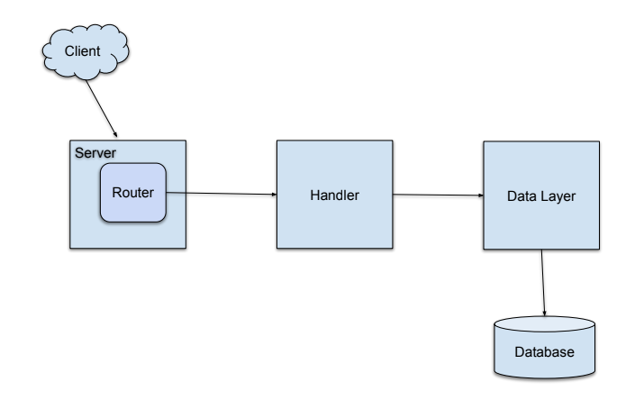

# Sample REST API In Go
Go (or Golang) has become a popular choice for building high-performance, concurrent, and scalable web services. Its simplicity, strong standard library, and efficiency make it an excellent language for creating REST APIs.

In this guide, we will walk through the process of building a REST API in Go from the ground up. We will cover the core concepts, project structure and practical examples for implementing a simple Product API.

## Core Concepts & Architecture
Before diving into code, it's important to understand the main components of a Go-based REST API.
- **Server:** The core of the application that listens to incoming requests on a specific port. In go, you typically use the net/http package to create an HTTP server.
- **Router:** A multiplexer that inspects the incoming request's URL and HTTP methods. It then forwards the request to the appropriate handler function. Popular choices include the standard library's http.ServerMux or more feature-rich third-party packages like gorilla/mux.
- **Handlers:** These are the functions that do the actual work. A handler receives the HTTP request, processes it(e.g., by interacting with a database), and writes a HTTP response back to the client. Typically, each API endpoint(like /products or /products/{id}) will have its own handler.
- **Models:** These are go structs that define the structure of your application's data. For example, in the Product REST API, a Product struct would define a product item.
- **Data Layer:** This is the part of the application that interacts with the database(e.g. PostgreSQL, MongoDB, or even an in-memory store). It handles the logic for creating, reading, updating, and deleting (CRUD) data.


Fig 1.0: High Level REST API Component Diagram 

### Project Setup
1. Install Go - https://go.dev/dl/
2. Version Control - Setup Git repository for the project
    - If you don't have a git account create one
    - Clone the Git repository on your local machine
    - You can still work on the project on your local machine without the version control but you will be missing out on the advantages that version controls systems such as git provides
4. Setup your IDE
    - Download and install Visual Studio Code (VSCode) - https://code.visualstudio.com/download
    - We will be using VSCode throughout this project
    - You can also use any IDE you are most comfortable with
5. Visual Studio Code Extensions
    - Go: The official Go extension
    - Coverage Gutters by ryanluker

Task 1: Project Setup
Clone Repo or Create Project Locally and setup the following
1. Initialize the go project
    - Run the command below, replacing <module-name> with your module name
    ```
    go mod init <module-name>
    ```
2. Install golangci-lint
    ```
    go install github.com/golangci/golangci-lint/cmd/golangci-lint@latest
    ```
3. Github Workflows
4. Gitignore
5. Makefile
6. Create main.go file